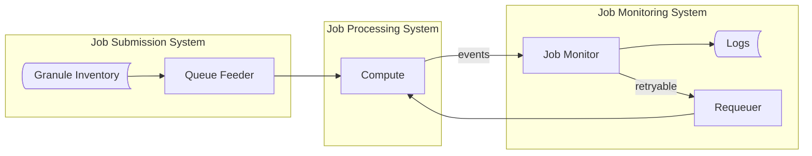
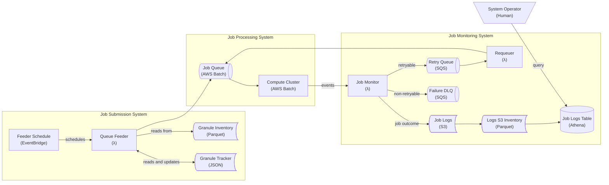
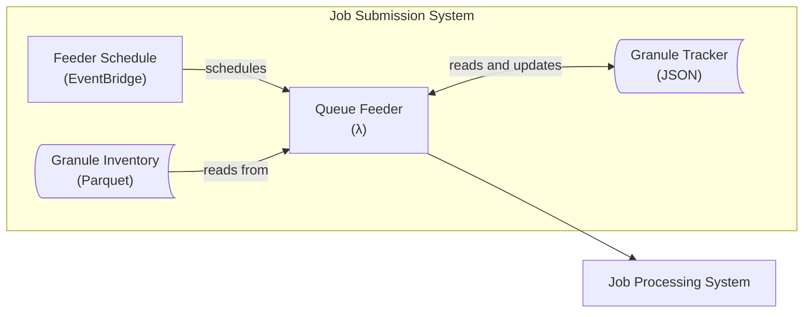

# HLS-VI Historical Orchestration System Design

This project orchestrates the backfill data production of the HLS-VI data product. Forward production of this data
product began on Feb 9, 2025. The job of this system is to backfill the rest of the HLS product archive with HLS-VI
results so we have a complete HLS-VI archive.

## System Overview

The backfill processing system contains three main elements:

1. A job submission system ("queue feeder") that submits granules from the inventory.
1. A job processing system to compute the HLS-VI product.
1. A job monitoring ("job monitor") and retry ("job requeuer") system to handle Ec2 Spot interruptions.

At a very high level, the system looks like:



With all system elements present:



The following sections will describe each sub-system in further detail and eventually describe the entire system in full
detail.

## Job Submission System

The "Job Submission System" controls the upper bound of the number of granules we process each day. We're generally rate
limited by the ability of the LPDAAC to ingest our data product, and we worked closely to ensure our data production
doesn't exceed the ability of their system to consume and publish our data products. We configure this rate using two
controls,

1. How many granules does the "Queue Feeder" submit at one time?
1. How frequently does the "Queue Feeder" submit jobs?

For example, if we schedule 1,000 jobs every hour, we would produce at most 24,000 granules per day.

Submitting jobs into our "Job Processing System" requires the granule inventory, a lightweight status tracker, and the
"Queue Feeder" system:



The "Queue Feeder" submits a job for each granule in the "Granule Inventory" by performing a few simple steps:

1. The "Feeder Scheduler" tells the "Queue Feeder" to process `N` granules.
1. The "Queue Feeder" checks how many queued jobs are in the Job Processing System, exiting early if above a threshold.
1. The "Queue Feeder" reads the progress through the inventory from the "Granule Tracker" log (`row_start`).
1. The "Queue Feeder" reads `N` granules from the "Granule Inventory" (`[row_start, row_start + N]`).
1. The "Queue Feeder" submits `N` jobs into the AWS Batch cluster.
1. The "Queue Feeder" updates the "Granule Tracker" with the updated number of submitted granules (`row_start + N`).

The sort order of the "Granule Inventory" determines how we work through the historical backfill. We work backwards from
the launch of the HLS-VI product so that users can start using the process for applications like time series analysis of
recent time periods as soon as possible.

We represent the processing of a granule as a "Granule Processing Event" containing some basic information that uniquely
describes the unit of work:

```python
class GranuleProcessingEvent:
    granule_id: str
    attempt: int
```

We only allow 1 invocation of the "Queue Feeder" to run at a time to ensure consistency of our (S3 based) "Granule
Tracker", so we have to balance the frequency of our job submission with the run length of each invocation. Fortunately
we haven't had issues where it takes too long to submit our desired submission count per invocation, but if this were to
happen we could increase job submission throughput by using AWS Batch "array jobs". This would increase throughput by
increasing the number of granules that will be processed per AWS Batch job creation, but would increase the complexity
of our job monitoring and requeuing systems.

To avoid overhead with scaling up and down our cluster, we want our cluster to always have more work to do but without
dramatically increasing the size of our processing queue. To avoid our "Job Processing" queue being overwhelmed, the
"Queue Feeder" will exit early if it detects that the "Job Processing" has too many jobs in the queue.

## Job Processing System

We use AWS Batch to compute the HLS-VI product backfill. AWS Batch was chosen because it glues together a variety of AWS
services that we need for a container execution system (queue, compute cluster, container execution, job tracking,
logging, monitoring, etc). We also have a lot of experience running jobs with AWS Batch for the HLS product.

The AWS Batch cluster has been configured to use Spot instances of the "compute optimized" family class. The HLS-VI
product generation is relatively light weight on memory, so the "compute optimized" family class was a great fit having
2GB of memory for every 1 vCPU. By choosing this instance family we also help avoid Spot market competition with the
"general purpose" (M) instance types used by the HLS product compute.

We configure our AWS Batch `JobDefinition` with a
["RetryStrategy"](https://docs.aws.amazon.com/batch/latest/userguide/job_retries.html) to use the automated job retry
feature. Specifically, AWS Batch will automatically retry failures due to Spot market interruptions and failures to pull
containers.

The "Job Submission System" is ultimately the rate limiting factor for the number of granules we produce each day, and
we've configured our AWS Batch cluster to be able to handle the jobs submitted.

## Job Monitoring System

Rather than polling for the status of our AWS Batch jobs as we do with StepFunctions in the `hls-orchestration`
pipeline, here we take a more event driven approach that monitors for AWS Batch
[job state change events](https://docs.aws.amazon.com/batch/latest/userguide/batch_job_events.html). The "Job Monitor"
system subscribes to updates from the queue associated with our AWS Batch cluster any terminal job statuses (e.g.,
"success" or "failure", but not "submitted" or "running") so that we can take action based on what happened at the end
of a job's lifecycle.

### Job Retries

The "Job Monitor" _always_ logs the outcome of the AWS Batch job. The one caveat is we ignore failures that occur when
the job would be retried by the AWS Batch JobDefinition's `RetryStrategy` (e.g., Spot market failures on the first or
second attempt). Jobs that succeed are logged and no further action is taken. However, the "Job Monitor" will also
forward the `GranuleProcessingEvent` for further action depending on the type of failure:

1. "Retryable" failures are sent to a "retry queue" for resubmission into the "Job Processing System".
   - Retryable failures usually occur because of Ec2 Spot market interruptions.
1. "Non-retryable" failures are sent to a "failure queue" for further triage.
   - This queue allows us to monitor for failures that require intervention (e.g., a bugfix).
   - If we fix a bug that caused the failure, we can easily redrive the failure queue into the "retry" queue to quickly
     reprocess the failures.

The "Job Requeuer" consumes `GranuleProcessingEvent`s from the "Retry Queue", increments the `attempt: int`, and
resubmits the job into the "Job Processing System".

### Job Logging

We use S3 as our data store for tracking the outcome of the `GranuleProcessingEvent`s we submit for every granule. We
store information about the `GranuleProcessingEvent`, the jobs' outcome (success, retryable failure, non-retryable
failure), and information about the AWS Batch job that processed the granule.

We organize these logs using a HIVE partitioning structure designed to help us easily summarize the status of all jobs
and quickly find the status of any specific granule. We primarily care about the job outcome, so we use this as the
first layer of partitioning. We subpartition by the acquisition date of the granule because we also want to track our
progress through time for all granules. We further subpartition by the granule ID and store logs for all job processing
attempts within the same prefix.

For example,

```
logs/outcome={failure | success}/acquisition_date={YYYY-MM-DD}/granule_id={GRANULE_ID}/attempt={attempt}.json
```

This partitioning strategy allows us to determine the outcome for a granules by scanning prefixes based on the outcome.
We can also answer questions about how many failures we have to analyze and retry without much effort given that the
vast majority of granules are successfully processed. When a failure is retried and succeeds, the "Job Monitor" will
relocate any logs for failed attempts to prune the number of failures we're potentially tracking.

We use S3 inventories to facilitate bulk analysis of these logs and construct tables using AWS Athena that take
advantage of the fact that we have embedded most of the useful information into our S3 path construction. Our granule
processing table contains the following information,

| Column             | Type      | Description                     |
| ------------------ | --------- | ------------------------------- |
| outcome            | str       | Job outcome (success, failed)   |
| platform           | str       | Satellite platform (L30, S30)   |
| acquisition_date   | timestamp | Acquisition date of the granule |
| granule_id         | str       | Granule ID for the job          |
| attempt            | int       | Attempt number                  |
| last_modified_date | timestamp | Last modified date of the log   |
| key                | str       | S3 key to the log file          |

For more information about summaries we can derive from this table, see the
[documentation about status reporting](./reporting.md).
